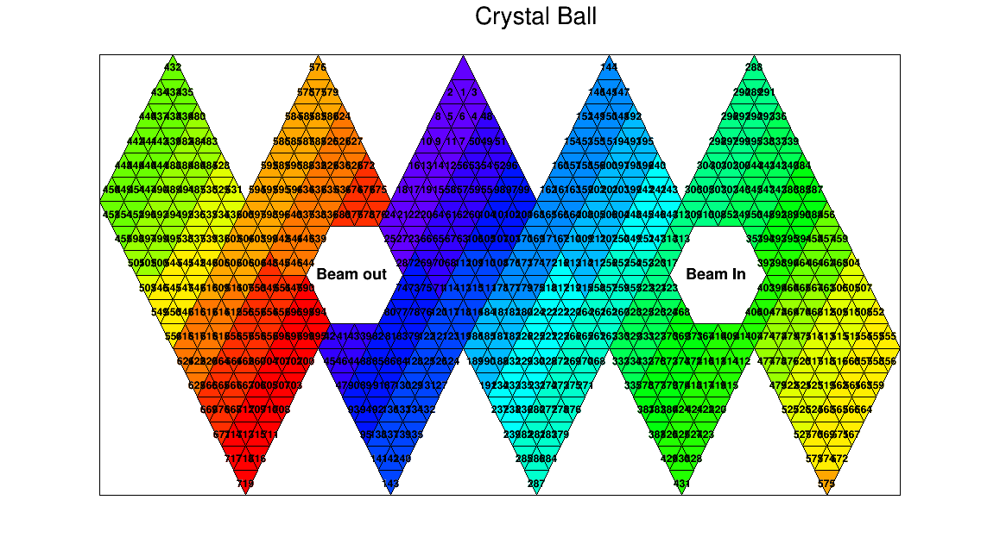

a2display
=========

Detector Display Histograms for A2



Installation
-----

```sh
  git clone https://github.com/osteffen/a2display.git
  cd a2display
  mkdir build
  cd build
  cmake ..
  make
```

How to use
----------

This creates a ''liba2display.so''. This file can be loaded in a ROOT session:
```c++
  gSystem->Load("liba2display.so");
```
After that the tow histogram classes `TH2CB` and `TH2TAPS` are available.
Every crystal can be accessed via `SetElement()` or `GetElement()` by the element number.
The numbering is identical to waht AcquROOT uses in current config files.
A full set of crystal values can be set at once by providing a `std::vector<Double_t>` or a `TH1`.
This allows creating 2D repesentations of crystal hit distributions directly from 1D histograms as used by AcquROOT.

In addition, there are the wrapper classes that pull data from existing TH1 histograms automatically by name:
`PollingHistogram<TH2CB>` and `PollingHistogram<TH2TAPS>`. Secify a name of a TH1 in the constructor and the data will
be copied over periodically in the background. This can directly be used in any AcquROOT/AcquDAQ session
without interfereing.
